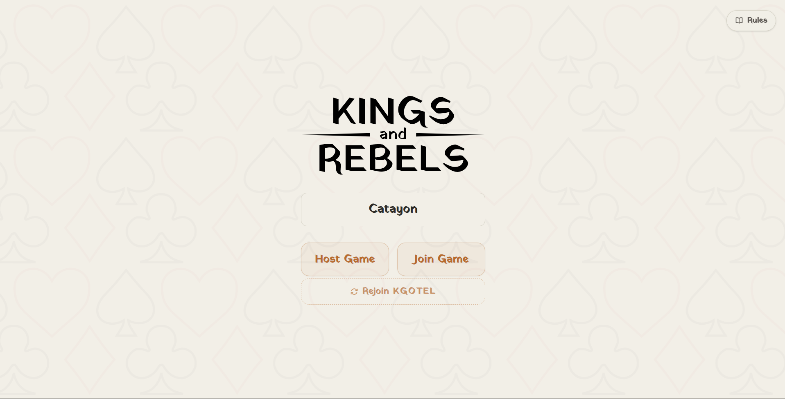
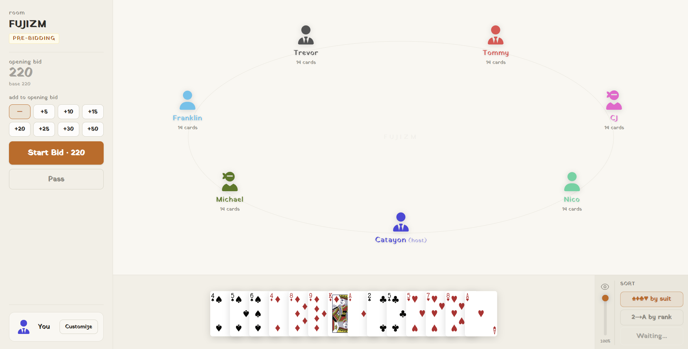
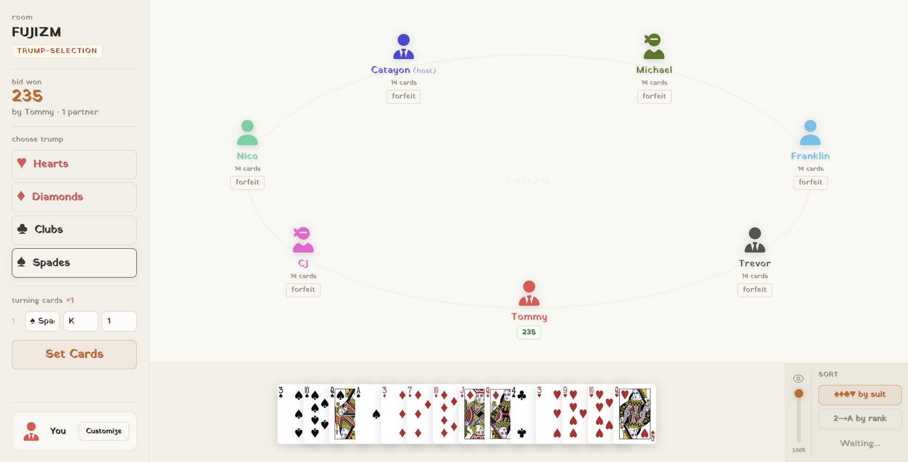
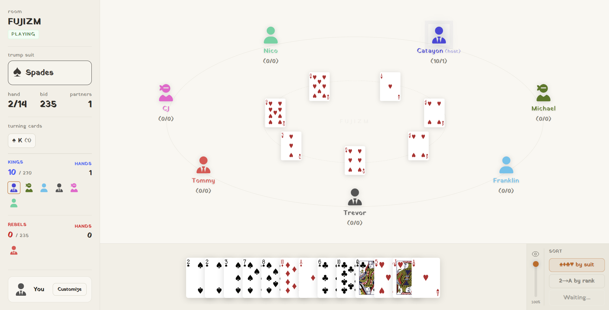

# Kings & Rebels (Three of Spades)

An elegant, real-time multiplayer trick-taking card game based on the popular **Three of Spades** (also known as *250*) card game. Built with a modern, high-fidelity stack consisting of **Next.js 16**, **React 19**, **TypeScript**, and **Tailwind CSS v4** on the frontend, and a **Node.js + Socket.io** server on the backend.

---

## Table of Contents
1. [Screenshots](#screenshots)
2. [Architecture Design](#architecture-design)
3. [Game Rules & Scoring System](#game-rules--scoring-system)
4. [Key Features](#key-features)
5. [Technology Stack](#technology-stack)
6. [Socket.io Event API Protocol](#socketio-event-api-protocol)
7. [Installation & Setup](#installation--setup)
8. [Running Locally](#running-locally)

---

## Screenshots






---

## Architecture Design

`Kings & Rebels` is designed as a real-time, event-driven multiplayer application. It uses a **decoupled Client-Server Architecture** where the client acts as a reactive rendering engine, and the server acts as the single source of truth for the game state.

### 1. Client-Server Division
*   **Backend Server ([server/socketServer.js](file:///c:/Programming%20Files/New%20Projects/newtos/server/socketServer.js))**: A lightweight Node.js HTTP server wrapped with Socket.io. It handles all matchmaking lobbies, room lifecycle, active deck generation, cryptographic token generation, dealer operations, validation rules for bids/trump selections, trick winner determination, point summation, and connection management.
*   **Frontend Client ([app/room/[roomId]/page.tsx](file:///c:/Programming%20Files/New%20Projects/newtos/app/room/[roomId]/page.tsx))**: A Next.js SPA client. It communicates with the backend solely via WebSocket events. It maintains a local copy of the `RoomState` and uses React hooks to selectively render appropriate screens (waiting lobby, bidding UI, trump selection board, card table, scoreboard) based on the game phase.

### 2. State Management & Live Room Synchronization
The game state is centralized on the server inside a memory store: `let rooms = {}`. 
Whenever a client performs a valid action (e.g., placing a bid, playing a card, custom lobby settings update):
1. The server receives the event and validates the action against the current state and player's identity.
2. The server updates the in-memory room object.
3. The server broadcasts the updated, sanitized state to all players in the room room using `io.to(roomId).emit("room-update", room)`.
4. The client state listener `socket.on("room-update", ...)` intercepts the update, updates its local `room` state variable, causing React to efficiently re-render the view.

### 3. Session-Token Based Reconnection Protocol
To protect games from internet dropouts and browser refreshes, the application implements a robust **15-second grace period reconnection protocol**:
*   **Session Token Generation**: When a player joins a lobby for the first time, the server generates a UUID `token` (`randomUUID()`) and registers it against the player's session, sending it to the client. The client stores this token in `localStorage`.
*   **Grace Period State Retention**: When a client socket disconnects, the server does not immediately delete the player. Instead, the server marks the player as `offline: true`, broadcasts a room update, and spins up a `setTimeout` timer for 15 seconds (`RECONNECT_GRACE_MS`).
*   **Handshake/Reconnection**: If the player reconnects (reopens tab, recovers network) within 15 seconds, the client sends the same name and the cached session token. The server matches the token, cancels the cleanup timeout, swaps the player's old socket ID with the new one, updates all mapped state references (such as cards, teams, colors, tricks), and reinstates the player seamlessly without disrupting the game.

### 4. Mathematical Bidding & Partner Thresholds
The game has 2 options, standard and custom rules. In standard, the partner thresholds are predefined. But in custom, host can create their own rules for partner threshold and limits on number of partners.
---

## Game Rules & Scoring System

### Card Points
The game is played with standard cards, but only specific rank-suit combinations carry points:
*   **Three of Spades (3S)**: **30 Points** (the most valuable card).
*   **Aces (A), Kings (K), Queens (Q), Jacks (J), Tens (T)**: **10 Points each** (across all suits).
*   **Fives (5)**: **5 Points each** (across all suits).
*   **All other cards (2, 4, 6, 7, 8, 9)**: **0 Points**.
*   **Total Points**: 250 points in a single deck. With 2 decks, the total is 500 points.

### Game Phases
1.  **Lobby**: Host sets player count (4 to 10), deck count (1 or 2), and rule settings (standard or custom). Players customize their avatar colors and dress styles.
2.  **Bidding**: Players bid in increments of 5. The minimum bid is computed based on player count (e.g., 110 points for 7 players). Players can pass/forfeit. The bidding ends when only one bidder remains.
3.  **Trump & Partner Selection**: The winning bidder declares the Trump suit (Hearts, Diamonds, Clubs, Spades) and names $N$ "Turning Cards" (e.g., Ace of Hearts, 10 of Clubs). These cards determine who the bidder's hidden partners will be.
    *   *Multi-deck rule*: When using 2 decks, there are duplicate cards. The bidder specifies a priority (e.g., "1st play of 10 of Clubs" or "2nd play of 10 of Clubs") to pinpoint their partner.
4.  **Trick Playing**: Standard trick-taking rules apply. Players must follow the lead suit if they have it. If they don't, they may play trump or discard. The trick winner collects all card points in that trick and leads the next trick.
5.  **Partner Discovery**: When a declared "Turning Card" is played, the player who played it is instantly added to the **Red Team** (Bidder's Team). All other players belong to the **Blue Team**.
6.  **Scoring & Game Over**: Once all cards are played, points are aggregated. If the Red Team collects points equal to or greater than the winning bid, they win the round. Otherwise, the Blue Team wins.

---

## Key Features

*   **Custom Game Rules**: Toggle custom rules to tweak minimum bid points and partner acquisition thresholds dynamically using sliders.
*   **Smart Card Sorting**: Sort cards in hand dynamically by *Suit* (Spades, Diamonds, Clubs, Hearts) or by *Rank* (value value).
*   **Robust Game Loop**: Live UI animations, visual indicators for current turn, offline indicators, and follow-suit warnings.
*   **Mobile Optimized**: Responsive sidebar navigation, compact card hands, and touch-friendly controls.

---

## Technology Stack

*   **Frontend**: Next.js 16 (App Router), React 19, TypeScript, PostCSS + Tailwind CSS v4.
*   **Backend**: Node.js, Socket.io v4.
*   **Assets**: SVGs for custom characters, custom logos, and standard card faces.

---

## Socket.io Event API Protocol

### Client-to-Server (`socket.emit`)
*   `create-room(payload, callback)`: Creates a new room. `payload` contains name, numPlayers, numDecks, and custom rules. Callback returns the generated `roomId`.
*   `join-room({ roomId, name, token })`: Joins an existing room. Allows reconnection if a valid token is provided.
*   `update-dress({ roomId, dress })`: Changes the player's dress outfit (`default` | `ninja` | `tie`).
*   `update-color({ roomId, color })`: Updates the player's avatar theme color.
*   `give-cards(roomId)`: Deals the cards to all players (Host only).
*   `start-bidding(roomId)`: Moves the game from lobby to bidding phase (Host only).
*   `place-bid({ roomId, amount })`: Places a bid. Must be at least 5 points higher than the highest bid.
*   `forfeit-bid(roomId)`: Forfeits from the bidding process.
*   `confirm-trump({ roomId, suit, turningCards, priorities })`: Submits the selected Trump suit, turning cards, and priorities (Bidding winner only).
*   `play-card({ roomId, card })`: Plays a card into the current trick.
*   `next-hand(roomId)`: Clears the table and proceeds to the next hand after a trick completes (Host only).

### Server-to-Client (`socket.on`)
*   `session-token(token)`: Sends the client a unique UUID token to store in localStorage for session restoration.
*   `room-update(roomState)`: Dispatches the complete synchronized room state to all clients in the room.
*   `room-error(message)`: Sends an error message to a client (e.g., "Room not found", "Name already taken").


---

## Installation & Setup

1.  **Clone the Repository**:
    ```bash
    git clone https://github.com/your-username/threeofspades.git
    cd threeofspades
    ```

2.  **Install Dependencies**:
    ```bash
    npm install
    ```

---

## Future Works
- Stats page after game ends (MVP, etc.)
- Sound Effects
- Changing the most valuable card
- Simple Chat System
- Improved animations